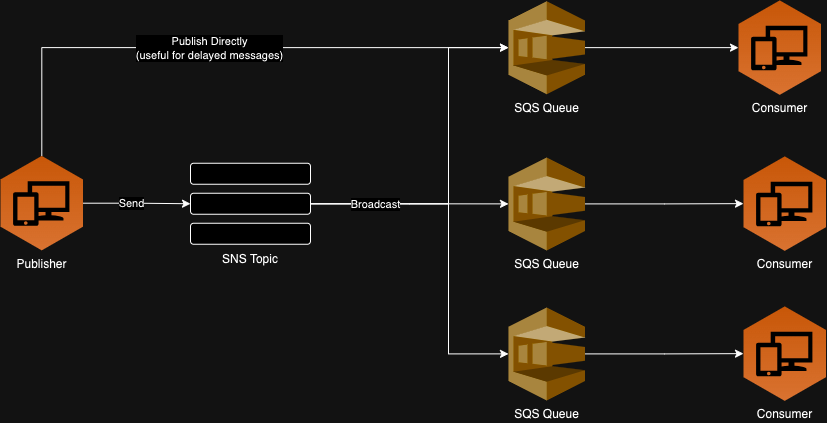

# 💡 About
The main objective of this project is to represent how can we work with AWS SNS (Simple Notification Service) and SQS (Simple Queue Service) as a **Message Broker** using NodeJS in a EDA (Event-Driven Architecture)


#### Main functionalities
* Create a SQS queue
* Create a SNS topic
* Subscriber a SNS topic in a SQS queue
* Send messages in a SNS topic and/or SQS queue
* Consume messages by SQS queue

## 🔧 How works



* Capabilities:
    * Delayed messages/queues
    * Broadcast messages
    * Direct messages
    * DLQ

#### ⚠️ Attentions

* SNS and SQS works with HTTP/HTTPS protocol 
    * 🚨 For this, is necessary to create a pooling to receive messages
* Every SNS topic needs a destination (and protocol reference), like:
    * AWS SQS ⬅️
    * AWS SES
    * AWS Lambda
    * HTTP/HTTPS
    * Mobile Push
    * Email

### 🖥️ Running

#### Docker
The respective [docker-compose.yaml](./docker-compose.yaml) will provide all the necessary resources, withi public exposure to the connection

```bash
docker compose -f ./docker-compose.yaml up -d
```

#### AWS CLI

After running the docker-compose file, we need to configure our AWS local environment. For this, lets install the [AWS CLI](https://docs.aws.amazon.com/cli/latest/userguide/getting-started-install.html), and run some commands:

```bash
$ export AWS_ACCESS_KEY_ID="na"
$ export AWS_SECRET_ACCESS_KEY="na"
$ export AWS_DEFAULT_REGION="eu-west-2"
$ aws configure --profile localstack
```

And, finally, just run the `npm start` to execute index.js file

---

### 🔧 Some Useful Commands

* Create queues

```base
aws sqs create-queue --endpoint-url http://localhost:4566 --queue-name [YOUR_QUEUE_NAME] --profile localstack
```

* List queues

```bash
aws sqs list-queues --endpoint-url http://localhost:4566 --profile localstack
```

* Create topics

```bash
aws sns create-topic --endpoint-url http://localhost:4566 --name [YOUR_TOPIC] --profile localstack
```

* List topics

```bash
aws sns list-topics --profile localstack
```

---

## References

* https://dev.to/flflima/rodando-sqs-localmente-com-localstack-3nap
* https://docs.localstack.cloud/user-guide/aws/sns/
* https://docs.localstack.cloud/user-guide/aws/sqs/
* https://github.dev/markcallen/snssqs